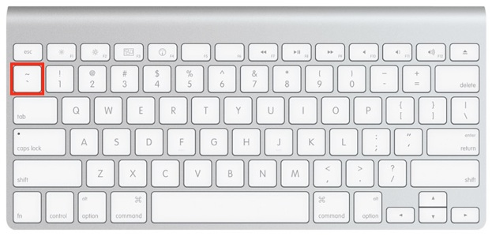

```{r setup, include=FALSE}
library(ggformula)
library(mosaic)
library(mosaicData)
library(mosaicCore)
library(DT)
library(learnr)
data(Galton)
knitr::opts_chunk$set(echo = FALSE)
```


<style type="text/css">
span.boxed {
  border:5px solid gray;
  border-radius:10px;
  padding: 5px;
}
span.invboxed {
  border:5px solid gray;
  padding: 5px;
  border-radius:10px;
  color: white;
}

table, td, th { border:0px; }

/* cellpadding */
th, td { padding: 5px; }

</style>

## The modeler's tilde

R provides a concise notation for describing the role that one or more variables are to play in a calculation. This notation, called a *formula*, is used so much in statistical computation that it is worth introducing even before the computations themselves.

Formulas always involve the tilde character.

```{r echo = FALSE, fig.align = "center"}

```

As a typewritten character, `~`, it's quite small and easy to miss. And in a small font, the  isn't much different from the minus sign (`-`). But tilde means something completely different from minus.

The position of  on the keyboard varies from brand to brand. On Apple keyboards, it's here.

```{r echo = FALSE, fig.align = "center", out.width = "40%"}

```

### Exercise

Find the  on your keyboard.


## Tilde constructs formulas


The word "formula" is used to describe an R expression with tilde. Usually the formula involves one or more names of variables. These are all legal formulas:

* `~ x`
* `y ~ x`
* `x ~ y`
* `y ~ x + z`
* `magic ~ abracadabra + smoke + mirrors`


Every formula has something to the *right* of the tilde. This could be a variable name, a number, a period, and so on.

```{r type-tilde2, exercise=TRUE, exercise.lines = 2, exercise.cap = "Scratch work space"}
```

Use the scratch work space above to try out the following expressions, one at a time, to see if they are legal in R. You'll know an expression isn't legal if R responds with an "unexpected end of input" or some other error statement. If there's no error, the formula will be printed. (Don't worry about the `environment` line. That's a bit of R jargon that we don't need.) 

```{r formula-form-quiz}
quiz(
  question("Is `~ .` legal?",
    answer("yes", correct = TRUE),
    answer("no")
  ),
  question("Is `~ 1` legal?",
    answer("yes", correct = TRUE),
    answer("no")
  ),
  question("Is `fish ~` legal?",
    answer("yes"),
    answer("no", correct = TRUE)
  ),
  question("Is `~ +` legal?",
    answer("yes"),
    answer("no", correct = TRUE)
  )
)
```


## Formulas as arguments


Many of the commands you construct will follow this template. You just have to fill in the blanks.

<center>
<h3><strong> <span class="boxed">function</span> ( <span class="boxed">formula</span> , data = <span class="boxed">data_table</span> , ... )</strong> 
</h3></center>


Each of the blanks plays a specific role. 


* **`function`** will be replaced with the name of the operation you want to perform. There are a couple dozen such operations that you will encounter frequently. Here, consider these two:    
    1. `df_stats` which calculates basic statistics.
    2. `gf_point` which constructs scatter plots. 
* **`formula`** is a formula, usually containing variables in the data table.
* **`data_table`** will be the name of a data table on which you want to perform the operation. `Galton` is a data table that has been pre-loaded for this example.
* **`...`**. Many functions take additional arguments specifying details of the operation. What these details are depends on the operation, and not all functions require additional arguments. For instance, the `df_stats()` function you will use next takes an additional argument specifying what statistic (e.g. the mean) to calculate.

## One- and two-sided formulas

Keep in mind the basic structure of a command:

<center>
<h3><strong> <span class="boxed">function</span> ( <span class="boxed">formula</span> , data = <span class="boxed">data_table</span> , ... )</strong> 
</h3></center>

Almost always, the formula used when applying a function will contain the names of variables in the `__data__` table. To illustrate, consider the `Galton` data table, which looks like this.

`r DT::dataTableOutput("galton_table")`
```{r echo = FALSE, context = "server"}
output$galton_table <- 
  DT::renderDT({datatable(Galton, rownames = FALSE)}, server = FALSE)
```


If there is just one variable involved in the operation, the name of that variable goes in the right-hand slot and the left one is unused. For instance:

```{r qstat1, exercise = TRUE}
df_stats( ~ height, data = Galton,  mean)
```

When there are two variables involved, typically one goes on the left of  and the other on the right, for instance:
```{r qstat2, exercise = TRUE}
df_stats(height ~ sex, data = Galton, mean)
```

### Exercise

In the following code block, replace the blank `__formula__` to create a scatterplot of child's `height` versus that of the childs `mother`.

```{r template1, exercise=TRUE, exercise.lines = 2, exercise.cap = "Using formulas"}
gf_point(__formula__, data = Galton)
```


<div id ='template1-hint'>
Remember that "height vs mother" means that the height variable goes on the y axis and the mother variable on the x-axis.
</div> 


### Exercise

Replace `__formula__` with the appropriate formula to draw a histogram of the `height` variable in `Galton`.

```{r hist1, exercise=TRUE, exercise.lines = 2, exercise.cap = "Using formulas", warning = FALSE, message = FALSE}
gf_histogram(__formula__, data = Galton)
```
